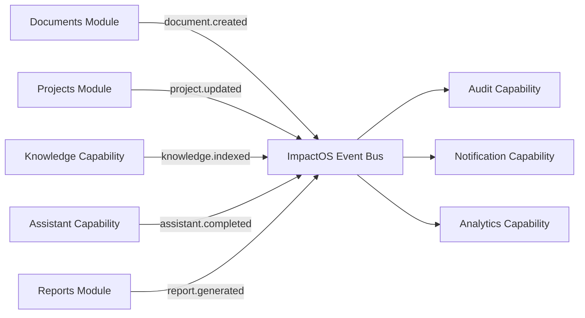
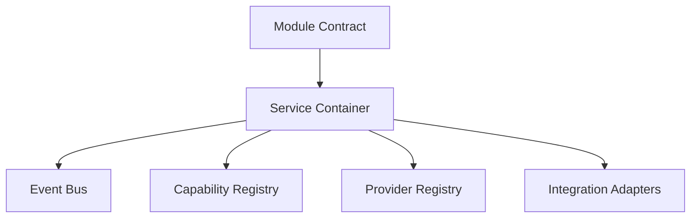
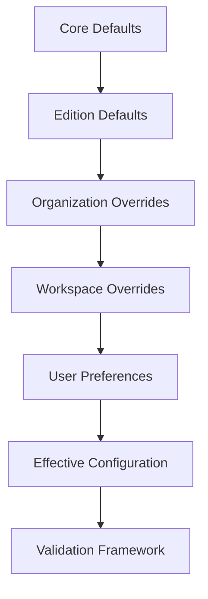

# ImpactOS Core Foundation Sprint 2

Sprint 2 completes the platform backbone described by `ImpactOS Architecture v1.0`.

This sprint does not add client functionality, business logic, UI redesign, styling, or demo improvements.

## Registries

| Registry | File | Responsibility |
|---|---|---|
| Capability Registry | `lib/impactos/capability-registry.ts` | Registers every platform and domain capability used by modules. |
| Module Registry | `lib/impactos/module-registry.ts` | Defines module metadata, permissions, dependencies, lifecycle, and required capabilities. |
| Edition Registry | `lib/impactos/edition-registry.ts` | Defines versioned Edition manifests and defaults. |
| Provider Registry | `lib/impactos/provider-registry.ts` | Registers replaceable providers behind integration ports. |
| Integration Registry | `lib/impactos/integrations.ts` | Registers adapter manifests and health checks. |

## Event Bus

Modules communicate by publishing events instead of importing one another.

## Service Container

Modules receive services through interfaces. They must not construct providers directly.

## Configuration Loading

Configuration loads in deterministic Architecture v1.0 order.

## Permission Engine

RBAC remains the v1 model. Evaluation now supports explicit allow/deny overrides and conditional rules so ABAC can be introduced later without changing the public contract.

Evaluation order:

1. Explicit deny rules.
2. Explicit allow rules.
3. Role-inherited grants.
4. Fail closed.

## Validation Framework

The validation framework checks:

- Capability registry dependencies.
- Module required capabilities and dependencies.
- Edition manifests.
- Effective configurations.
- Provider capability and replacement references.
- Permission rule quality.

## Provider Boundary

OpenAI, Supabase, Mapbox, n8n, and Mock are registered as replaceable providers.

Modules must depend on provider-independent ports such as `model`, `data`, `maps`, and `workflow`.
